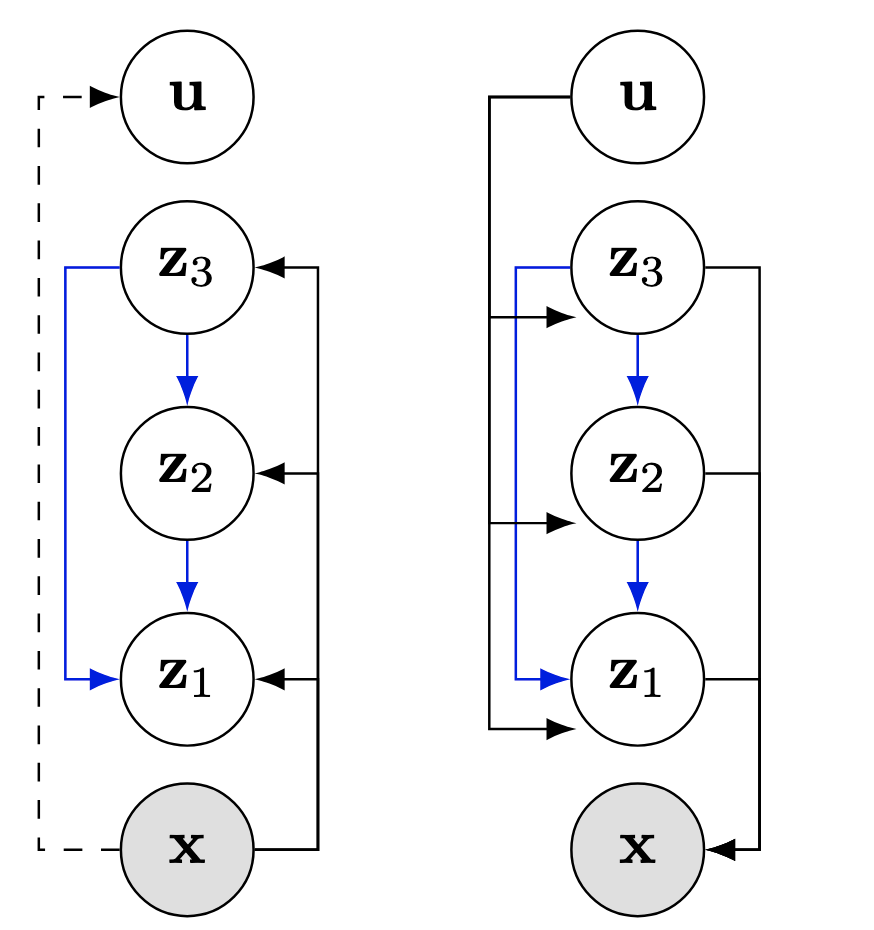

# Hierarchical VAE with a Diffusion-based VampPrior

This repository contains the code for the experiments from the paper:

[Hierarchical VAE with a Diffusion-based VampPrior](https://openreview.net/forum?id=NUkEoZ7Toa)

**[Anna Kuzina](https://akuzina.github.io/), [Jakub M. Tomczak](https://jmtomczak.github.io/)**

---
## Abstract
<table>
<tr>
<td style="width:10%">
<i>
Deep hierarchical variational autoencoders (VAEs) are powerful latent variable generative models. 
In this paper, we introduce Hierarchical VAE with Diffusion-based Variational Mixture of the Posterior Prior (VampPrior).
We apply amortization to scale the VampPrior to models with many stochastic layers. 
The proposed approach allows us to  achieve better performance compared to the original VampPrior work and other deep hierarchical VAEs, while using fewer parameters.
We empirically validate our method on standard benchmark datasets (MNIST, OMNIGLOT, CIFAR10) and demonstrate improved training stability and latent space utilization.
</i>
</td>
<td>
<p align="center">
  
</p>
</td>
</tr>
</table>

## Experiments 
### Environment Setup
We list the required packages in `environment.yml`:
```bash
conda env create -f environment
```

### Weights and Biases Setup
We use [w&b](https://wandb.ai) to track experiments, save and load trained models, thus it is required to run the code. 
 

### Run experiments
Configuration for all the experiments are provided in `configs/experiments` folder. 

For example, to run the experiment with the MNIST, use the following command:
```bash
python run_experiment.py experiment=mnist/dvp_vae
```

To run baseline Ladder VAE, use the following command:
```bash
python run_experiment.py experiment=mnist/ladder
```

The code supports multi-gpu training (make sure to set `train.ddp: True`):
```bash
mpiexec -n 4 python run_experiment.py experiment=mnist/dvp_vae
```


### Cite
If you found this work useful in your research, please consider citing:

```text
@article{kuzina2024hierarchical,
  title={Hierarchical VAE with a Diffusion-based VampPrior},
  author={Kuzina, Anna and Tomczak, Jakub M},
  journal={Transactions on Machine Learning Research},
  year={2024}
}
```
### Acknowledgements
This research was (partially) funded by the Hybrid Intelligence Center, a 10-year programme funded by the Dutch Ministry of Education, Culture and Science through the Netherlands Organisation for Scientific Research, https://hybrid-intelligence-centre.nl.

Some of the experiments were carried out on the Dutch national infrastructure with the support of SURF Cooperative.
